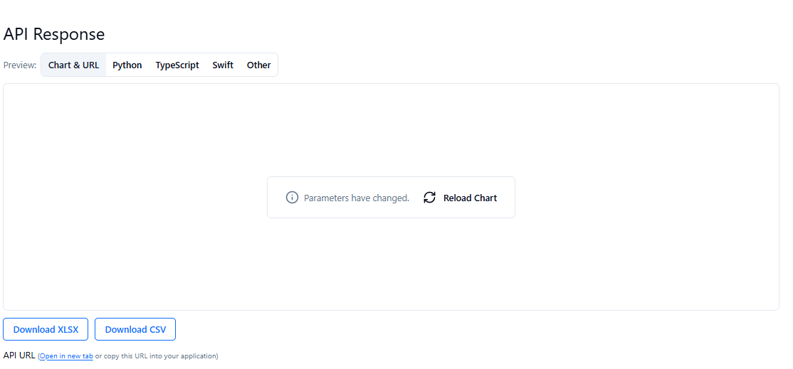

# Análisis de Datos

## API

Se utiliza la API de [Open-Meteo](https://open-meteo.com/en/docs?latitude=-38.7396&longitude=-72.5984&daily=precipitation_sum,wind_speed_10m_max,temperature_2m_max,temperature_2m_min,wind_gusts_10m_max,sunshine_duration,precipitation_hours,weather_code&past_days=92&time_mode=time_interval&start_date=2025-02-24&end_date=2025-06-09) para obtener datos meteorológicos históricos. El objetivo es predecir de manera eficiente si lloverá próximamente, utilizando las métricas disponibles. Para ello, se selecciona un periodo pasado que pueda ser contrastado, comparando las predicciones con lo que realmente ocurrió.

### Variables utilizadas

- **weather_code:** Código que representa la condición meteorológica más significativa del día.
- **temperature_2m_max:** Temperatura máxima diaria a 2 metros sobre el suelo.
- **temperature_2m_min:** Temperatura mínima diaria a 2 metros sobre el suelo.
- **wind_speed_10m_max:** Velocidad máxima diaria del viento a 10 metros de altura.
- **wind_gusts_10m_max:** Ráfagas máximas de viento diarias a 10 metros de altura.
- **sunshine_duration:** Duración diaria de la luz solar directa, según la definición de la OMM.
- **precipitation_hours:** Número de horas con precipitación durante el día.
- **precipitation_sum:** Suma total diaria de precipitación (lluvia, chubascos y nieve).

### Instrucciones para descargar el dataset de Open-Meteo

Para obtener el dataset meteorológico sin necesidad de una clave privada, sigue estos pasos:

1. Accede a la [página de Open-Meteo](https://open-meteo.com/en/docs?latitude=-38.7396&longitude=-72.5984&daily=precipitation_sum,wind_speed_10m_max,temperature_2m_max,temperature_2m_min,wind_gusts_10m_max,sunshine_duration,precipitation_hours,weather_code&past_days=92&time_mode=time_interval&start_date=2025-02-24&end_date=2025-06-09) utilizando el enlace proporcionado al inicio de este README.

2. Configura los parámetros deseados (ubicación, variables meteorológicas, rango de fechas, etc.) según tus necesidades. El enlace ya incluye una configuración de ejemplo.

3. Desplázate hacia abajo en la página hasta encontrar la sección de resultados o la opción de descarga.

4. Haz clic en el botón de descarga (por ejemplo, "Download CSV" o "Export Data") que aparece en la interfaz, como se muestra en la siguiente imagen:

   

5. Guarda el archivo descargado en tu computadora. Este archivo será el dataset que utilizarás para el análisis de datos.

> **Nota:** No es necesario registrarse ni utilizar una API key para descargar los datos de esta manera.

## Inicializar proyecto

### 1. Crear de entorno virtual
```
    python3 -m venv .venv
```
### 2. Activar entorno virtual

windows (powershell)
```
    .\.venv\Scripts\Activate.ps1
```

windows (linux)
```
    source .venv/bin/activate
```

### 3. Instalar paquetes

``` 
    pip install -r requirements.txt
```
